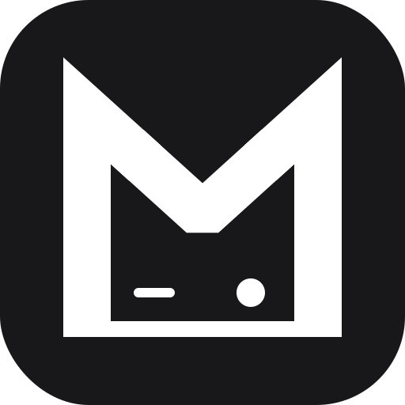

<p align="center">
  
</p>

<h1 align="center">Moddy</h1>

A [Decky Loader](https://github.com/SteamDeckHomebrew/decky-loader) plugin for one-click mod installation and management on Steam Deck, directly in Game Mode.

## Install

Moddy isn't in the Decky store yet, so install it from its URL:

1. Make sure [Decky Loader](https://github.com/SteamDeckHomebrew/decky-loader) is installed.
2. In the Decky panel, open the **settings** (the ⚙️ icon) and enable **Developer mode**.
3. Use **Install from URL** and enter **`get.moddy.gg`**.

That's it. Moddy appears in the Decky panel. It's **alpha software** — please [report anything that breaks](#reporting-issues). Mods are third-party software and run with full access to your system. **Please read the [Disclaimer](#disclaimer) before installing anything.**

## Features

- Browse and install mods without leaving Game Mode
- One-click install of entire Nexus collections
- Mod loader installation and management (MelonLoader, BepInEx, Lovely, REFramework, SMAPI, UE4SS, and more)
- Version selection with rollback support
- Dependency resolution and cascade disable/uninstall
- Update checking for mods and mod loaders
- Controller-native UI with d-pad navigation

## Supported Games

Moddy installs mods from several sources. What you need to do depends on where a game's mods come from.

### Thunderstore
No setup — Moddy installs the required mod loader (BepInEx) automatically.

- Enter the Gungeon
- PEAK
- Risk of Rain 2
- ROUNDS
- Valheim

### Nexus Mods
Requires a Nexus account and a **personal API key** (Premium only — see [Setting up your Nexus Mods API key](#setting-up-your-nexus-mods-api-key)).

- Monster Hunter Rise
- Monster Hunter World
- No Man's Sky
- Palworld
- Resident Evil 4
- Slime Rancher 2
- Stardew Valley

### Steam Workshop
No setup — Moddy subscribes the mods through Steam; just play.

- BattleBlock Theater
- Brotato
- Castle Crashers
- Cities: Skylines
- Crusader Kings II
- Crusader Kings III
- Darkest Dungeon
- Dead Cells
- Don't Starve Together
- Dwarf Fortress
- Europa Universalis IV
- Garry's Mod
- Hand of Fate 2
- Haste
- Hearts of Iron IV
- Kenshi
- Killing Floor 2
- Left 4 Dead 2
- Oxygen Not Included
- Portal 2
- Project Zomboid
- RimWorld
- Rivals of Aether
- Sid Meier's Civilization V
- Sid Meier's Civilization VI
- Slay the Spire
- Stellaris
- Tabletop Simulator
- The Binding of Isaac: Rebirth
- Total War: Three Kingdoms
- Total War: Warhammer II
- Total War: Warhammer III
- XCOM 2

### Other
- Balatro *(via [Balatro Mod Index](https://github.com/skyline69/balatro-mod-index))*
- Satisfactory *(via [ficsit.app](https://ficsit.app))*

### Planned
- Vampire Survivors
- Subnautica
- and more :)

## Mod Sources

Moddy downloads mods and mod loaders **directly from their original publishers** — GitHub, [Thunderstore](https://thunderstore.io), the [Balatro Mod Index](https://github.com/skyline69/balatro-mod-index), [Nexus Mods](https://www.nexusmods.com), [ficsit.app](https://ficsit.app), and the Steam Workshop — the same way other mod managers do. It does **not** host, redistribute, or modify any mod content; each mod's license is set by its author.

Nexus downloads use the official API with your own personal API key. Moddy currently supports **Premium accounts only** (free accounts can browse, but Nexus only returns download links to Premium members). Your key is stored only on your device and sent only to Nexus.

### Setting up your Nexus Mods API key

To browse or install Nexus mods you need a Nexus account and a **personal API key**:

1. Sign in at [nexusmods.com](https://www.nexusmods.com), then open **Account settings → [API Keys](https://www.nexusmods.com/users/myaccount?tab=api)**.
2. Under **Personal API Key**, click **Generate** (or copy your existing one).

Then add the key to Moddy. The key is ~90 random characters, so pasting is far easier than typing it on the Game Mode keyboard. Pick whichever is convenient:
- **Desktop Mode:** open the file `~/homebrew/settings/moddy/settings.json` and set it to:
```json
"nexus_api_key": "PASTE_YOUR_KEY_HERE"
```
- **SSH:** ssh into your Steam Deck and run:
  ```bash
  mkdir -p ~/homebrew/settings/moddy
  cat > ~/homebrew/settings/moddy/settings.json <<'EOF'
  { "nexus_api_key": "PASTE_YOUR_KEY_HERE" }
  EOF
  sudo systemctl restart plugin_loader
  ```
  (The folder name is lowercase `moddy`; the file is read on startup.)

- **Game Mode:** open the Decky panel → **Moddy → Settings** and type the key into the *Nexus Mods API key* field with the on-screen keyboard.

## Reporting issues

Moddy is in alpha, so bug reports are genuinely useful. Please open an issue on the [GitHub issue tracker](../../issues) and include:

- What game and mod you were installing
- What you expected vs. what happened
- A **log bundle** (see below)

**Exporting logs:** open the Decky panel → **Moddy → Diagnostics → Export logs**. This saves a `moddy-logs-<timestamp>.zip` to your Steam Deck's **Desktop**. Switch to Desktop Mode and attach it to your issue (drag it into the GitHub upload box). The bundle contains Moddy's log files and basic version info; your **Nexus API key is not included**.

## Disclaimer

Mods installed through Moddy are **third-party software not authored, audited, or endorsed by this project**. They are downloaded from their original publishers and run with the same privileges as your user account. They are **not** sandboxed or isolated from the rest of your system.

Use Moddy and any mods you install **at your own risk**. The author accepts no responsibility or liability for any damage arising from their use, including but not limited to corrupted or lost save data, broken or unbootable game installations, system instability, exposure to malicious code, or **bans from anti-cheat systems or online services**. Modifying a game may violate its terms of service, and online/multiplayer titles in particular may detect mods and penalize your account.

Review the source and author before installing anything you don't recognize. Moddy is provided **"AS IS"**, without warranty of any kind. See the [License](#license) below for the full warranty disclaimer.

## Acknowledgements

- The **Balatro Mod Index** (catalog data) is by the [Balatro Mod Manager](https://github.com/skyline69/balatro-mod-manager) project, © 2025 Efe, licensed under the [MIT License](https://github.com/skyline69/balatro-mod-index/blob/main/LICENSE). Moddy uses only the index data, but none of that project's source code.

## Support these projects, not me

Moddy is mostly glue. The real work behind every install is done by the projects below. **Please send your support their way before mine.** The best ways to help any of them: star the repo, report bugs, and contribute. Where a project shows a **Sponsor** button, consider donating.

**Moddy runs on:**

- **[Decky Loader](https://github.com/SteamDeckHomebrew/decky-loader)** — the homebrew loader that makes Moddy, and the entire Steam Deck plugin scene, possible.

**Mods are loaded by:**

- **[MelonLoader](https://github.com/LavaGang/MelonLoader)** — by LavaGang
- **[BepInEx](https://github.com/BepInEx/BepInEx)**
- **[Lovely](https://github.com/ethangreen-dev/lovely-injector)** — by ethangreen-dev
- **[REFramework](https://github.com/praydog/REFramework)** — by praydog
- **[SMAPI](https://github.com/Pathoschild/SMAPI)** — by Pathoschild
- **[UE4SS](https://github.com/UE4SS-RE/RE-UE4SS)** — by the UE4SS team
- **[Satisfactory Mod Loader](https://github.com/satisfactorymodding/SatisfactoryModLoader)** — by the Satisfactory Modding team
- **[Stracker's Loader](https://www.nexusmods.com/monsterhunterworld/mods/1982)** — by Stracker

**Catalogs are curated by:**

- **[Balatro Mod Index](https://github.com/skyline69/balatro-mod-index)** — the community-maintained Balatro catalog, by the [Balatro Mod Manager](https://github.com/skyline69/balatro-mod-manager) project (Efe).

**And above all,** the many developers of the frameworks and mods you actually install — Moddy is nothing without what they make. Find them on [Thunderstore](https://thunderstore.io), [Nexus Mods](https://www.nexusmods.com), and their own pages, and support them directly.

## AI Disclosure

A large portion of this codebase was made with the help of AI. I'm a single person working on this in the small amounts of free time I get. AI is a tool that lets me ship this at all. I know some people are against the use of AI, so I'd rather be upfront about its use than pretend otherwise.

## Development

```bash
pnpm i
pnpm run build
```

See **[CONTRIBUTING.md](CONTRIBUTING.md)** for the full setup — requirements, deploying a build to a Steam Deck, running the backend tests, and how games get added (many are pure JSON; some need backend code).

## License

Copyright (C) 2026 FunkyByte1

This program is free software: you can redistribute it and/or modify it under the terms of the GNU General Public License as published by the Free Software Foundation, either version 3 of the License, or (at your option) any later version.

This program is distributed in the hope that it will be useful, but WITHOUT ANY WARRANTY; without even the implied warranty of MERCHANTABILITY or FITNESS FOR A PARTICULAR PURPOSE. See the [GNU General Public License](LICENSE) for more details.